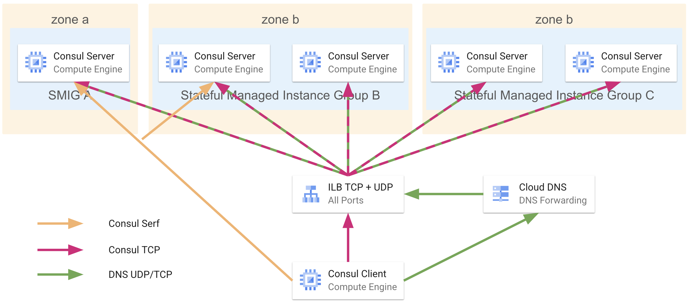
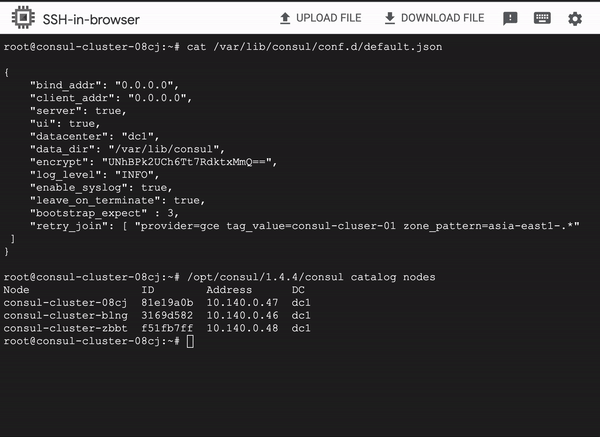

# Consul Cluster Setup On GCE

Consul is a distributed service mesh solution that provides service discovery, health checking, key-value storage, and more. Each node in a Consul cluster runs a Consul agent, which communicates with other agents in the cluster to maintain a consistent view of the services running on the network. When an application needs to discover a service, it can send a request to the Consul cluster, which will return the address of the nearest healthy instance of the service.

---
### Achieved architecture using this Terraform code

 

### List of resources created by terraform
1. Static IP
2. DNS forwarding private zone
3. TCP + UDP ILB
4. Instance Template
5. MIG
6. Backend
7. Firewall rules
8. Service account
9. Health Check

### Create infra by terraform
```shell
terraform init
terraform plan
terraform apply
```

### Steps to validate consul cluster
Connect to any of your consul cluster node and use below commands
```shell
/opt/consul/1.4.4/consul catalog nodes
dig consul.service.dc1.consul
dig @localhost -p 8600 consul.service.dc1.consul
```

